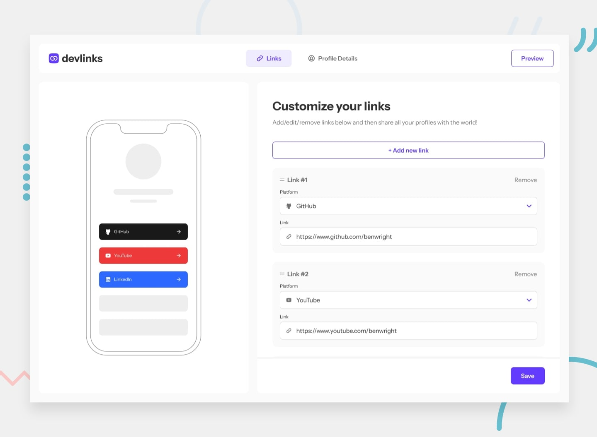

# Devlinks

Devlinks is a full-stack link sharing platform for developers to showcase all their important links in one place. Create a personalized profile and share a single link that connects others to all your social media accounts and professional profiles.

## Features

- **Link Management**: Create, read, update, and delete your social media links
- **Link Reordering**: Drag and drop functionality to organize your links
- **Profile Customization**: Update profile picture, name, and contact information
- **Mobile Preview**: See how your profile appears on mobile devices in real-time
- **Responsive Design**: Optimized layout for all device sizes
- **Form Validations**: Input validation for all forms including URL pattern matching
- **Link Sharing**: Copy your unique profile link to clipboard with one click
- **User Authentication**: Create an account and securely log in to manage your profile
- **Data Persistence**: All profile and link data saved to database

## Tech Stack

- Frontend: Next.js 15
- Backend: Supabase
- Database: PostgreSQL (Supabase)
- Authentication: Supabase Auth
- Styling: TailwindCSS
- Component Library: ShadCN UI
- Hosting: Vercel

## Usage

1. Register for an account or log in
2. Add your profile details including profile picture, name, and email
3. Add links to your various social media profiles and websites
4. Arrange links by dragging and dropping them in your preferred order
5. Preview your profile in the mobile mockup
6. Copy your unique profile URL to share with others

## Acknowledgments

- Challenge from [Frontend Mentor](https://www.frontendmentor.io/challenges/linksharing-app-Fbt7yweGsT)
- Author: [Brian Millonte](https://brianmillonte.vercel.app/)
